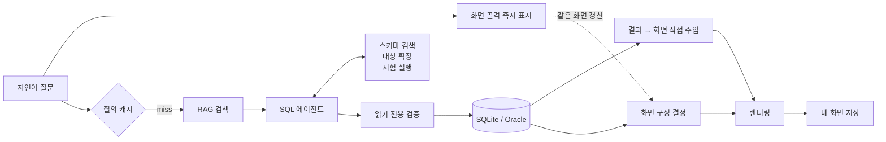

# QueryCanvas

자연어로 물으면 AI가 SQL을 만들어 실행하고, 그 결과에 맞는 화면까지 직접 그려주는 데이터 조회 시스템입니다.

미리 만들어 둔 화면이 하나도 없습니다. "최근 3개월 카테고리별 매출 비중 보여줘"라고 물으면 브리핑 카드와 차트, 표로 구성된 화면이 그 자리에서 만들어지고, 마음에 들면 이름을 붙여 저장해 메뉴처럼 다시 쓸 수 있습니다.

## 주요 기능

**자연어 질의** — 질문을 던지면 SQL 생성부터 화면 렌더링까지 자동으로 진행됩니다. 진행 상황은 단계별로 실시간 표시됩니다.

**화면 자동 생성** — 조회 결과의 성격에 따라 어떤 위젯을 쓸지 AI가 결정합니다. 집계 결과면 차트를, 단일 수치면 큰 숫자 카드를, 상세 목록이면 표를 배치합니다.

**즉시 응답** — 질문 직후 화면 골격이 먼저 뜨고, SQL이 끝나면 데이터가 표에 채워지고, 마지막으로 차트와 요약이 완성됩니다. 빈 화면을 기다리지 않습니다.

**되묻기** — 질문이 모호하면 바로 조회하지 않고 무엇이 필요한지 되묻습니다. 같은 이름의 대상이 여러 명이면 AI가 스스로 후보를 확인하고 구분해서 조회합니다.

**꼬리질문** — 현재 화면의 데이터로 답할 수 있는 질문은 다시 조회하지 않고 바로 텍스트로 답합니다.

**화면 수정** — "차트를 파이로 바꿔줘" 같은 지시로 데이터는 그대로 둔 채 화면 구성만 고칠 수 있습니다.

**내 화면 저장** — 저장한 화면을 다시 열면 SQL만 재실행되고 화면 구성은 그대로 재사용됩니다. "이번 달"처럼 시점에 따라 달라지는 조건은 상대 표현으로 저장되어 다음 달에도 유효합니다.

**개인정보 보호** — 조회 결과 원본은 LLM을 거치지 않고 화면에 직접 주입됩니다. AI가 참고하는 샘플에서는 개인정보 컬럼 값이 제외됩니다.

**관리자 콘솔** — 프롬프트 편집, 학습 데이터 관리, 검색 가중치 조정, 파이프라인 추적, 골든셋 평가 실행과 결과 비교를 웹에서 할 수 있습니다.

## 동작 흐름



SQL 생성은 한 번에 끝내는 방식이 아니라 도구를 쓰는 에이전트 루프입니다. 모델이 필요하면 스키마를 다시 검색하고, 이름이 겹치는 대상을 확인하고, 확정 전에 SQL을 시험 실행해 스스로 고칩니다. 다만 읽기 전용 검증은 도구 안과 파이프라인 뒤쪽 양쪽에서 강제되므로 모델이 우회할 수 없습니다.

## 기술 스택

| 영역 | 사용 기술 |
|---|---|
| 백엔드 | FastAPI, SSE 스트리밍 |
| AI | Anthropic Claude — 도구 사용, 구조화 출력, 프롬프트 캐싱 |
| UI 프로토콜 | A2UI v0.9 — `a2ui-agent-sdk`, `@a2ui/react` |
| 검색 | ChromaDB, BAAI/bge-m3 임베딩 |
| SQL 안전성 | sqlglot |
| 프론트엔드 | React 19, Vite, TypeScript, ECharts |
| 테스트 | pytest, GitHub Actions |

파이프라인 단계마다 필요한 지능 수준이 달라서 모델을 나눠 씁니다. SQL 생성과 화면 결정에는 상위 모델을, 질문 분류와 오류 수정에는 경량 모델을 씁니다. 모든 분류와 생성 호출은 구조화 출력을 사용합니다.

## 시작하기

```bash
# 1. API 키 설정
cd backend
cp .env.example .env          # ANTHROPIC_API_KEY 채우기

# 2. 백엔드
pip install -r requirements.txt
uvicorn main:app --port 8008

# 3. 프론트엔드
cd ../frontend
npm install
npm run dev                   # http://localhost:5173
```

첫 기동 시 mock 데이터 생성, 임베딩 모델 다운로드, 벡터 학습이 자동으로 실행됩니다. 관리자 콘솔은 http://localhost:5173/admin 입니다.

```bash
# 단위 테스트 — LLM 호출 없음
cd backend && python -m pytest tests

# 화면 렌더 검증 — LLM 호출 없음
cd frontend && npm run check:a2ui

# 골든셋 평가 — API 키 필요
cd backend && python eval/run_eval.py
```

## 데모

[docs/DEMO.md](docs/DEMO.md) 에 5분짜리 진행 순서가 있습니다. 기본 도메인은 커머스 주문·매출이고, mock 데이터는 실행일 기준 최근 12개월로 매일 자동 생성되므로 "이번 달" 같은 질문이 항상 유효합니다.

## 다른 업무 도메인으로 바꾸기

도메인에 묶이는 자산은 모두 `backend/domains/<이름>/` 한 곳에 모여 있습니다.

| 파일 | 역할 |
|---|---|
| `prompts.py` | SQL 프롬프트, 화면 결정용 도메인 설명, 추천 질문 |
| `generate_mock.py` | mock 데이터 생성기 |
| `training_data/` | 스키마와 SQL 패턴, 업무 문서 |
| `virtual_views/` | 자주 쓰는 조회를 미리 정의한 가상 view |
| `info_collectors.yaml` | 이름으로 대상을 찾는 조회 템플릿 |
| `golden_questions.yaml` | 평가용 골든 질문 |

이 여섯 가지를 작성하고 `DOMAIN` 환경변수만 바꾸면 됩니다. 애플리케이션 코드는 건드릴 필요가 없습니다.

## 프로젝트 구조

```
backend/
  main.py                    # FastAPI 진입점, SSE 파이프라인
  config.py                  # 모델 맵, 도메인 설정
  domains/<name>/            # 도메인 팩
  text_to_sql/
    sql_agent.py             # 에이전트 방식 SQL 생성
    sql_validator.py         # 읽기 전용 검증
    vector_store.py          # RAG 검색
  ui_engine/
    ui_decision.py           # 조회 결과 → 화면 구성 결정
    a2ui_catalog.py          # 컴포넌트 카탈로그, 스트리밍 파서
    anonymizer.py            # 개인정보 마스킹
  db/saved_views.py          # 내 화면 저장
  eval/                      # 골든셋 평가
  tests/                     # 단위 테스트
frontend/
  src/pages/QueryPage.tsx    # 질의 화면
  src/pages/admin/           # 관리자 콘솔
  src/components/A2uiRenderer.tsx
  src/lib/a2ui/catalog.tsx   # 커스텀 컴포넌트 카탈로그
```

새 시각화 컴포넌트는 프론트 카탈로그와 백엔드 카탈로그 양쪽에 등록해야 합니다. 자세한 계약과 주의사항은 [docs/a2ui-notes.md](docs/a2ui-notes.md) 를 참고하세요.

## 한계

- 인증과 권한 관리가 없습니다. 데모 목적의 프로젝트입니다.
- 파이프라인이 동기 방식이라 다중 사용자 환경에는 적합하지 않습니다.
- Oracle 연결 경로와 DDL 파서는 준비되어 있지만 실제 운영 DB로 검증하지는 않았습니다.
